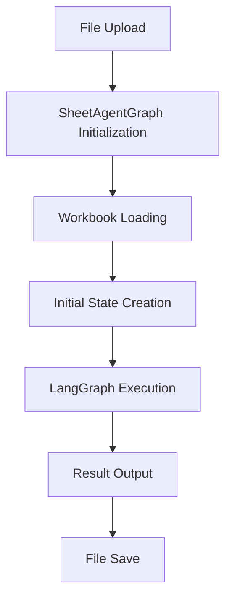
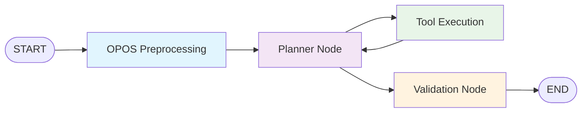

# SheetAgent Workflow Architecture

## Overview

This document provides a comprehensive visualization and explanation of the SheetAgent workflow architecture, specifically enhanced with OPOS (Open Posts) intelligence for financial data analysis.

## High-Level Architecture



## Core Components

### 1. SheetAgentGraph Class
**Purpose**: Main orchestrator class that encapsulates the entire workflow
**Location**: `app/graph/graph.py`

**Key Responsibilities**:
- Initialize language models (GPT-4o-mini)
- Set up tool bindings
- Create prompt chains
- Manage execution lifecycle

### 2. GraphState Management
**Purpose**: State container that tracks workflow progress
**Location**: `app/graph/state.py`

**State Components**:
```python
{
    # Static Components
    "problem": SheetProblem,
    "sandbox": Sandbox,
    "planner_chain": Runnable,
    "max_steps": int,
    "output_dir": Path,
    "prompt_manager": PromptManager,
    
    # Dynamic Components  
    "messages": List[BaseMessage],
    "step": int,
    "tool_executions": int,
    "current_sheet_state": str,
    "previous_sheet_state": str,
    
    # OPOS Intelligence
    "opos_preprocessing_complete": bool,
    "opos_structure_results": Dict,
    "cumulative_detection_results": Dict,
    "validation_complete": bool
}
```

## LangGraph Workflow

### Node Architecture



### 1. OPOS Preprocessing Node
**Entry Point**: Always the first node executed
**Purpose**: Intelligent structure detection for German financial data

**Process Flow**:
```
1. Extract sheet name from state
2. Detect OPOS indicators (German financial terms)
3. Run structure analysis:
   - Column type detection (invoice numbers, dates, amounts)
   - German terminology identification
   - Currency detection
4. Run summary row detection:
   - Keyword-based detection ("debitor", "total", etc.)
   - Empty key field analysis
   - Format change detection
5. Store results in state for later use
6. Generate processing recommendations
```

**Key Outputs**:
- 45 cumulative rows identified (in test case)
- High-confidence column mapping
- Processing guidance for planner

### 2. Planner Node
**Purpose**: LLM-powered decision making and task coordination
**Model**: GPT-4o-mini with tool bindings

**Routing Logic**:
```python
def planner_routing(state):
    current_step = state.get("step", 0)
    max_steps = state.get("max_steps", 10)
    tool_executions = state.get("tool_executions", 0)
    
    # Hard limits (prevent infinite loops)
    if current_step >= max_steps: return END
    if tool_executions >= 15: return "validation"
    
    # Smart routing
    if should_validate(state): return "validation"
    if has_tool_calls(last_message): return "tools"
    if early_stage: return "tools"  # Force progress
    else: return "validation"
```

**Decision Factors**:
- Step count limits (max 10 steps)
- Tool execution limits (max 15 executions)
- Validation triggers (last 2 steps)
- Tool call detection in LLM response

### 3. Tool Execution Node
**Purpose**: Execute Python code and data manipulation
**Available Tools**:

1. **python_executor**: Secure Python code execution in sandbox
2. **cell_range_reader**: Excel cell range reading
3. **identify_summary_rows**: OPOS cumulative row detection
4. **detect_opos_structure**: German financial column analysis

**Safety Features**:
- Sandboxed execution environment
- Tool execution counting
- State tracking after each execution

### 4. Validation Node
**Purpose**: Quality assurance for OPOS data analysis
**Triggers**: Near end of processing (step >= max_steps - 2)

**Validation Checks**:
- Summary row exclusion verification
- Currency consistency validation
- Calculation accuracy review
- OPOS best practices compliance

## Execution Flow Details

### Step-by-Step Process

```
Step 0: OPOS Preprocessing
├── Detect OPOS indicators
├── Analyze 45 cumulative rows
├── Map German column headers
└── Generate processing guidance

Step 1-7: Planner ↔ Tools Cycle
├── Planner receives OPOS guidance
├── Plans multi-step OPOS analysis:
│   ├── 1. Create cumulative row list
│   ├── 2. Create invoice row list  
│   ├── 3. Create credit row list
│   ├── 4. Completeness checks
│   ├── 5. Sum calculations
│   ├── 6. Aging reports (invoices)
│   ├── 7. Aging reports (credits)
│   ├── 8. Top 10 analyses
│   └── 9. Duplicate detection
└── Tools execute Python analysis code

Step 8: Validation
├── Verify summary row exclusion
├── Check calculation accuracy
├── Validate OPOS compliance
└── Generate quality report

Step 9: END
├── Save final workbook
└── Return analysis results
```

### Termination Conditions

**Normal Termination**:
- Validation completes successfully
- All OPOS analysis tasks completed
- Results saved to "Analysis" sheet

**Safety Termination**:
- Max steps reached (10 steps)
- Max tool executions reached (15 executions)
- Recursion limit hit (25 cycles)

## OPOS Intelligence Integration

### Structure Detection Algorithm

```python
# Column Type Detection
column_patterns = {
    'invoice_number': {
        'keywords': ['invoice', 'rechnung', 'belegnr', 'beleg'],
        'data_patterns': [r'^[0-9]+$', r'^[A-Z]{1,3}[0-9]+$']
    },
    'due_date': {
        'keywords': ['fällig', 'faellig', 'valuta', 'due'],
        'data_patterns': []  # Date format detection
    },
    'amount': {
        'keywords': ['betrag', 'summe', 'wert', 'eur'],
        'data_patterns': [r'^-?[0-9.,]+$']
    }
}
```

### Cumulative Row Detection

**Heuristic 1**: Keyword Detection
- Search for "debitor", "total", "sum", "gesamt"
- Identify structural boundary markers

**Heuristic 2**: Empty Key Fields
- Analyze first 5 columns for emptiness
- Threshold: >60% empty fields + amounts present
- Indicates summary/rollup rows

### German Financial Terminology

```python
german_terms = [
    "Buchungsdatum",     # Booking Date
    "Belegart",          # Document Type  
    "Belegnummer",       # Document Number
    "Buchungsschlüssel", # Posting Key
    "Währung",           # Currency
    "Nettofälligkeit"    # Net Due Date
]
```

## Error Handling & Safety

### Recursion Prevention
- **Graph Recursion Limit**: 25 cycles
- **Runtime Recursion Limit**: 25 cycles  
- **Step Counting**: Prevents infinite loops
- **Tool Execution Limits**: Prevents tool abuse

### Error Recovery
```python
try:
    response = planner_chain.invoke(messages)
    return updated_state_with_response
except Exception as e:
    logger.error(f"Error in planner: {e}")
    return state_with_incremented_step  # Continue execution
```

### State Consistency
- Step counter always increments
- Tool execution tracking
- Sheet state monitoring
- Message history preservation

## Performance Optimizations

### OPOS Preprocessing Benefits
1. **Early Structure Detection**: Avoid repeated analysis
2. **Intelligent Routing**: Skip non-OPOS workflows  
3. **Cumulative Row Pre-identification**: Prevent double-counting
4. **German Term Recognition**: Optimize for financial data

### Execution Efficiency
- **Tool Binding**: Pre-compile available tools
- **Sandbox Reuse**: Persistent Python environment
- **State Caching**: Avoid redundant calculations
- **Smart Termination**: Early completion when possible

## Configuration Parameters

### Adjustable Limits
```python
max_steps = 10              # Total workflow steps
max_tool_executions = 15    # Tool usage limit
recursion_limit = 25        # LangGraph cycle limit
validation_trigger = -2     # Steps before validation
```

### Model Configuration
```python
model = "gpt-4o-mini"      # OpenAI model
timeout = 60               # LLM call timeout
temperature = 0.0          # Deterministic responses
```

## Monitoring & Observability

### LangSmith Tracing
- **@traceable decorators**: On all major nodes
- **Execution tracking**: Step-by-step monitoring
- **Performance metrics**: Timing and resource usage
- **Error tracking**: Failure point identification

### Logging Strategy
```python
logger.info(f"Executing planner node at step {state['step']}")
logger.warning(f"Max steps ({max_steps}) reached, ending")
logger.error(f"Error in planner node: {e}")
```

## Integration Points

### External Components
- **Sandbox**: `app/core/sandbox.py`
- **Prompt Manager**: `app/core/prompt_manager.py`  
- **OPOS Tools**: `app/graph/tools_cumulative_detector.py`
- **Analysis Service**: `app/services/analysis_service.py`

### API Integration
- **FastAPI Endpoints**: `/api/endpoints/opos.py`
- **File Upload**: Multi-format support (XLSX, CSV)
- **Result Download**: Generated analysis files
- **Error Reporting**: Structured error responses

## Future Enhancements

### Planned Improvements
1. **Dynamic Step Allocation**: Adjust limits based on data complexity
2. **Model Selection**: Choose optimal model per task type
3. **Parallel Processing**: Concurrent analysis for large files
4. **Enhanced Validation**: ML-based quality scoring
5. **Custom Tool Creation**: User-defined analysis functions

### Scalability Considerations
- **Memory Management**: Large file handling
- **Concurrent Users**: Multi-tenant execution
- **Resource Limits**: CPU and memory constraints
- **Cache Strategies**: Result reuse and optimization

This architecture provides a robust, intelligent, and scalable framework for automated financial data analysis with specialized OPOS intelligence capabilities.
