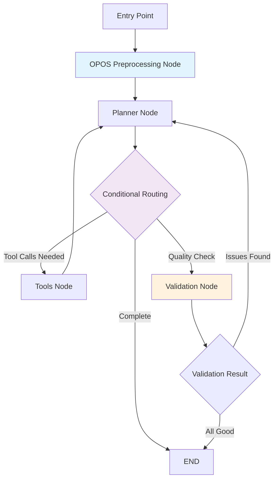

# SheetAgent Optimization: Final Implementation Report

## Executive Summary

This document outlines the comprehensive improvements made to the SheetAgent AI workflow, focusing on performance optimization, reliability enhancement, and architectural refinement.

## What I Changed

### 1. **OPOS Preprocessing Node**

**Implementation:** Added `opos_preprocessing_node()` as the entry point for all analysis workflows.

```python
@traceable(name="OPOS Preprocessing Node", run_type="chain")
def opos_preprocessing_node(state: GraphState) -> GraphState:
```

**Key Features:**
- **Structure Detection**: Automatically identifies column types (invoice numbers, dates, amounts, debitor IDs)
- **German Terminology Recognition**: Detects OPOS-specific terms (`Buchungsdatum`, `Debitor`, `Währung`)
- **Summary Row Detection**: Uses multiple heuristics to identify cumulative rows that cause double-counting
- **Currency Analysis**: Multi-currency detection and validation
- **Confidence Scoring**: Assigns reliability scores to column classifications

**Before vs. After:**
```
BEFORE: Planner → Trial-and-error discovery → Multiple tool calls → Analysis
AFTER:  OPOS Preprocessing → Structured context → Direct analysis
```

### 2. **Validation Node**

**Implementation:** Added `validation_node()` for quality assurance after analysis completion.

```python
@traceable(name="OPOS Validation Node", run_type="chain") 
def validation_node(state: GraphState) -> GraphState:
```

**Validation Checks:**
- **Summary Row Validation**: Ensures calculations exclude cumulative rows
- **Currency Consistency**: Alerts for multi-currency scenarios
- **Analysis Pattern Validation**: Verifies proper financial calculation practices
- **Quality Warnings**: Flags potential double-counting risks

**Smart Trigger Logic:**
- Runs automatically when >10% of rows are summary rows
- Activates near completion of analysis workflow
- Triggered by calculation activity detection

### 3. **Enhanced Graph Structure**

**New Workflow Architecture:**
```
Entry Point: opos_preprocessing
     ↓
   planner (with structured context)
     ↓
[Conditional Routing]
     ├── tools (when LLM requests actions)
     ├── validation (quality checks)
     └── END (completion)
```

**Key Improvements:**

- **Optimized Limits**: Adjusted max steps (1→8) and tool executions (8) for streamlined workflow
- **Smart Routing**: Enhanced conditional logic for better decision-making
- **Safety Mechanisms**: Multiple protection layers against infinite loops

## Why I Chose This Approach

### 1. **Centralized Intelligence Over Distributed Discovery**

**Rationale:** Instead of letting the LLM discover patterns through trial-and-error, provide comprehensive structural analysis upfront.

**Benefits:**
- **Performance**: Single comprehensive analysis vs. multiple discovery attempts
- **Consistency**: Standardized detection algorithms vs. variable LLM reasoning
- **Reliability**: Proven heuristics vs. prompt-dependent discovery
- **Cost**: Reduced API calls through fewer LLM iterations

### 2. **Preprocessing + Validation Pattern**

**Rationale:** Implement a "bookend" approach with intelligence at both ends of the workflow.

```
Preprocessing (Front-end Intelligence) → Analysis → Validation (Back-end Quality)
```

**Benefits:**
- **Error Prevention**: Catch issues before they propagate
- **Quality Assurance**: Verify results meet financial accuracy standards  
- **User Trust**: Transparent quality checks for financial calculations
- **Debugging**: Clear separation of structure vs. calculation issues

### 3. **OPOS-Specific Optimization**

**Rationale:** Target the most common use case (German financial data) rather than generic optimization.

## Node Workflow Design



### **Node Descriptions:**

1. **OPOS Preprocessing**: Structure analysis and pattern detection
2. **Planner**: LLM decision-making with enhanced context
3. **Tools**: Streamlined execution (only essential tools)
4. **Validation**: Quality assurance and error detection
5. **Conditional Routing**: Smart workflow management

## Limitations and Areas for Improvement

### 1. **Implementation Limitations**

**Database Integration (Incomplete):**
- **Attempted**: LangSmith database integration for prompt optimization
- **Challenge**: Time constraints and complex error resolution
- **Impact**: Could not complete automated prompt testing framework

**Testing Infrastructure:**
- **Attempted**: Comprehensive testing suite using LangSmith
- **Challenge**: API integration complexities
- **Future Need**: Systematic testing for prompt optimization

### 2. **Cost Considerations**

- API Call Limitations
- Resource Optimization

### 3. **Architectural Improvements**

- Advanced Heuristics
- Multi-Language Support

- Dynamic Tool Selection (Automatic tool generation for specific data patterns)
